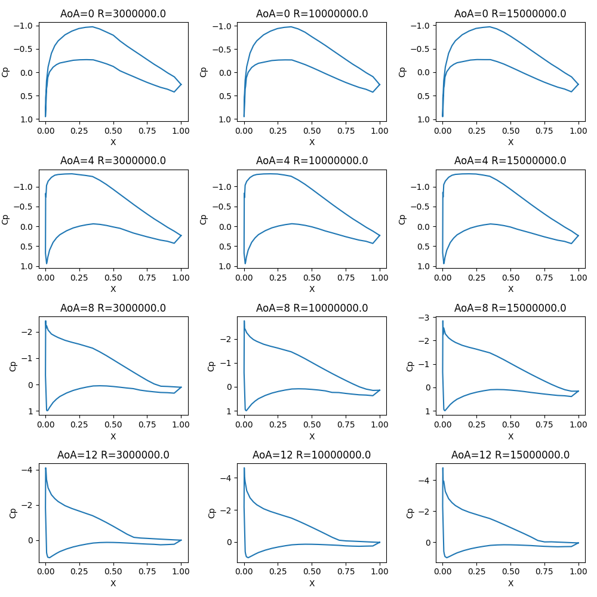

# Report on NACA63(3)-618 airfoil

## Aerodynamic Polar Coefficients
   

**CL vs AoA:** Graph becomes more linear (less exponential) as well as shifting upward with higher Reynolds numbers.\
This indicates that in scenarios with high turbulence (higher Reynolds numbers) you must increase the angle of attack more to achieve the same lift in less turbulent scenarios (lower Reynolds numbers)
 

**CD vs Aoa:** Graph stays the same shape but upper bound decreases from ~0.08 to ~0.04, specifically after changing the Reynolds number from 10 million to 15 million.\
Since the Reynolds number is increasing drastically, this means the viscosity is substantially lower at each increase leading to lower friction and therefore a lower drag.

**CM vs Aoa:** Similar to the CL vs AoA graph, while the graph keeps its curved shape, the slopes of different sides approaches a constant.\
Since , where M, S, and c remain constant, slight increases in the dynamic pressure (q) caused by an increased Reynolds number leads to a slightly smaller CM.

**CL/CD vs AoA:** From a Reynolds number of 3 million to a Reynolds number of 15 million, the CL/CD graph keeps the same shape overall while graph itself shifts upward.\
This is largely because of the increase in CL graph but this indicates that in order to get a higher lift-drag ratio you must have a higher AoA value at higher Reynolds numbers.

## Pressure Coefficient Distributions

**Pressure Distribution:** Comparing different angles of attack with different Reynolds numbers shows the graphs having little to no differences, highlighting that the Reynolds number has little to no effect on the pressure distribution.

## Boundary Layer Properties at the Trailing Edge

**Boundary Properties:** The graphs become more erratic with higher Reynolds numbers. All graphs have their largest x-values at a Reynolds number of 10 million.
* Looking at the displacement thickness and momentum thickness graphs, you can see a direct correlation.\
Drag and momentum thickness also have a direct correlation. Since wind turbines recieve more energy from lift than drag, it is important to minimize drag.\
Due to the previously stated relationships, D-thickness and M-thickness must be minimized.\
As seen in the graphs, while one of the minimums tends to stay around 20º AoA, the other minimum drifts from 0º to around -5º.
* Since the shape factor graph becomes more erratic, with fewer minimums, as the Reynolds number increases, there are less options for angle of attack to decrease the shape factor and create a later transition from laminar to turbulant flow.\
